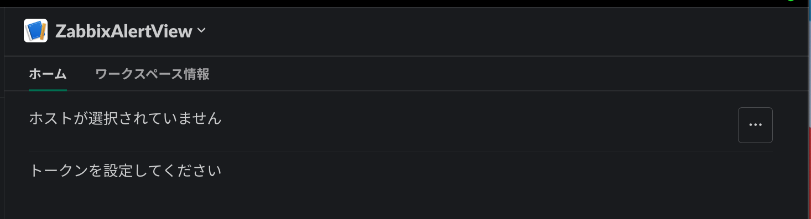

# zabbix_slack_app

Slack APP の Homeタブ で現在発生しているZabbixの障害を表示  
Zabbix API を使用して障害のクローズやアクナレッジが可能  

  

## インストール

1. クローンとビルド

```bash
    git clone https://github.com/KajiwaraKensei/zabbix_slack_app.git
    cd zabbix_slack_app
    make init
```

2. `./manifest.yml`からSlack Appを作成しワークスペースにインストール。`./compose.yml`にTokenを設定  
(SLACK_APP_TOKENはApp-Level Tokensは手動で作成)


compose.yml

```yml  
      SLACK_BOT_TOKEN: ""
      SLACK_APP_TOKEN: ""
```

3. コンテナ起動

```bash
    make up
```

4. Slack App のホームタブを開き、メッセージが表示されたら正常に動作してます  

  

add zabbix server から追加  


